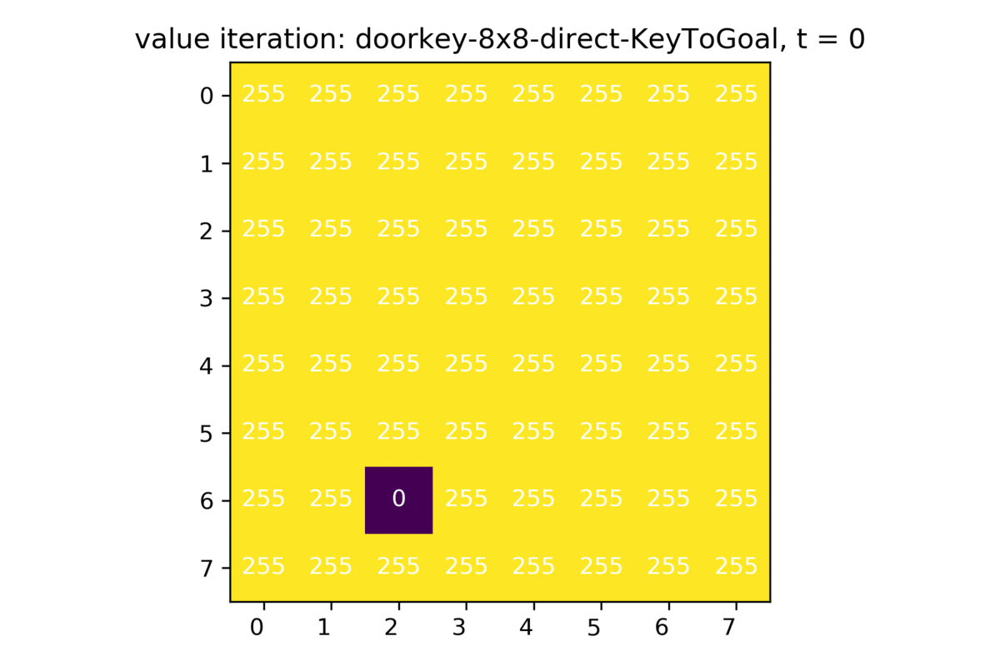

# ECE276B_PR1_SP20
 Project 1: Markov Processes and Dynamic Programming/Deterministic Shortest Path Applied to Motion Planning in a Maze. For ECE 276B at UCSD. 
 
 Consult my [Project Report](https://github.com/roumenguha/ECE276B_PR1_SP20_MDP/blob/master/ECE276B_PR1_Report_RoumenGuha.pdf) in the code folder for more background. 

 We did not solve the problem of the shortest path from START to GOAL, but instead solved two simpler sub-problems: START to KEY, and KEY to GOAL. The logic here is is that once the agent has the key, the door becomes traversable, and hence once we are at the KEY we simply need to focus on getting to the GOAL. This leads to sub-optimal solutions, but in most situations not *much* worse (except for the 'doorkey-8x8-normal' environment).
 
 One of the issues with splitting the problem into two sub-problems is that our agent is forced to enter the KEY's cell after picking up the key. We were able to generate an action sequence from the shortest sequence of nodes that avoided this problem, and for the provided example environment generated an identical action sequence as the example action sequence. However the agent did not move in the same path that the label-correcting algorithm dictated it should for some other environments, and in the case of the environment 'doorkey-6x6-normal', the agent failed completely to reach the DOOR, much less the GOAL. We included these in the zip file 'gifs-incorrect.7z' in case it is of interest to the reader. Here is an example of the difference between the optimal path I chose and what the true optimal path would be:
 
  Provided action sequence            |  Generated action sequence 
:------------------------------------:|:-------------------------:|:-------------------------:
 |  

 The action sequence we include in this report and generate in our implementation is therefore less optimal than it could have been, but it is guaranteed to reach the GOAL eventually, and in most cases, it is able to do this with $\epsilon$-optimality. We suspect we would be able to resolve this issue if we had slightly more time or slightly more brainpower, but nothing in life is ever perfect. 
 
 Maze Traversal            |  Value Iteration (Start-to-Key) |  Value Iteration (Key-to-Goal)
:-------------------------:|:-------------------------:|:-------------------------:
 |   | 
:-------------------------:|:-------------------------:|:-------------------------:
 |   | 
:-------------------------:|:-------------------------:|:-------------------------:
 |   | 
:-------------------------:|:-------------------------:|:-------------------------:
 |   | 
:-------------------------:|:-------------------------:|:-------------------------:
 |   | 
:-------------------------:|:-------------------------:|:-------------------------:
 |   | 
:-------------------------:|:-------------------------:|:-------------------------:
 |   | 
